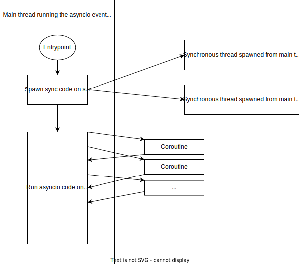

This repo contains some sample code on how to best run AsyncIo code using Python.

Asyncio uses an even loop that usually runs on a single thread.
Using coroutines, you can add concurrency to your code and add async tasks to the event loop.

Keep in mind, when using asyncio, that all your code that runs on the event loop should use the asyncio syntax.
E.g.: if you write 'time.sleep(1)' instead of 'await asyncio.sleep(1)', you effectively block the event loop and prevent other tasks from running!
In the example below, you should always use 'await asyncio.sleep(1)' in the main thread running the event loop, and you are allowed to use 'time.sleep(1)' in the spawned synchronous threads.

The code snippits in the repo contain an example of how to use asyncio with synchronous code (see the 'with_threading.py' file).

Also, keep in mind this is also true for any blocking call. For example, if you do a HTTP call to a REST API, while you are waiting for this call to return you are effectively blocking the event loop. Instead, use the aiohttp library for this, which allows async HTTP calls (see example 'fast_api_sample.py').

