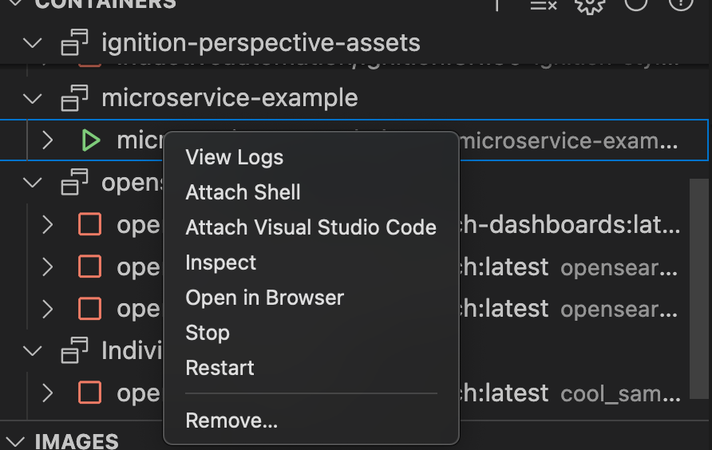
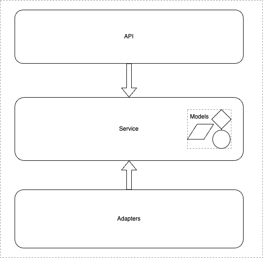

# Documentation

## Table of Contents
1. [Run in commandline](#run-in-commandline)
2. [Run in VSCode](#run-in-vscode)
3. [Test](#test)
4. [Deployment](#deployment)
5. [Architecture](#architecture)
6. [Readings](#readings)

## Run in commandline <a name="run-in-commandline"></a>

### Create virtual environment

Depending on your specific setup run one of these options:
```bash
python -m venv venv
python3 -m venv venv
python3.11 -m venv venv
```

### Activate virtual environment

Depending on your specific setup run one of these options:
```bash
Linux:
source venv/bin/activate
Windows:
venv\Scripts\activate
```

### Install dependencies
```bash
pip install -r requirements.txt
```

### Run service
```bash
# SET EVIRONMENT
export VARIABLE1="TEST123"
export VARIABLE2="TEST456"
export VARIABLE3="http://localhost:9999"

# RUN SERVER
python src/main.py
```

### Deactivate virtual environment
```bash
deactivate
```

## Run in VSCode <a name="run-in-vscode"></a>
Here a [launch.json](../.vscode/launch.json) file is used. This file should not have secrets. [.gitignore](../.gitignore).

Useful extensions for Visual Studio Code.
```
autopep8 (Microsoft)
ruff (Astral Software)
docker (Microsoft)
docker Compose (p1c2u)
draw.io Integration
YAML (Red Hat)
TOML (tamasfe)
```


You can do development in the container in the following way.

First run the microservice with the help of the docker-compose file. If other services aren’t needed, run:
```docker compose up  microservice-example -d```

If you have Microsoft Docker extension installed to VS Code, look up the running container, right-click and choose the 'Attach Visaul Studio Code'.

As the code folder is mounted, you don't lose your changes when the docker stops. 


## Test <a name="test"></a>
For testing, the pyramid is used as guideline. <br>
Test types: 
```
   *    - e2e tests (3)
  ***   - integration tests (2)
 *****  - unit tests (1)
```

1. everything which can be run "fast" and anytime
2. we have one integration tests only for grafana_api in the grafana_folder
3. e2e running scenarios which do something and can be checked at the end

Tests are separated in the 'Test' folder. 

```
--test
   |- unit  << all the fast running tests
   |- adapters << testing if the requests sent to grafana succeed or fail
   |- e2e << e2e test calling the endpoints of graflink from a generated client
```

The unit tests are fast and no need to install/start anything. 

Integration tests are slower or need some tool to run in the meantime. 

The <b>pytest</b> Python library is used.

## Deployment <a name="deployment"></a>

The repo uses CI in github. Definition of the github piplines is in the .github folder.


In the kubernetes folder you can find the manifests for deploying. Either you can do it manually or using argocd application and create a "continues deployment".


1. Manually

```bash
kubectl config use-context <kubernetes-context>
kubectl apply -k /kubernetes/overlays/<folder-the-cluster>
```

Also check out github workflow for deployment.

2. ArgoCD
Simplest is to copy the argo.yaml manifest through the argocd ui. 


## Architecture <a name="architecture"></a>



## Readings <a name="readings"></a>
Some useful links to read:
